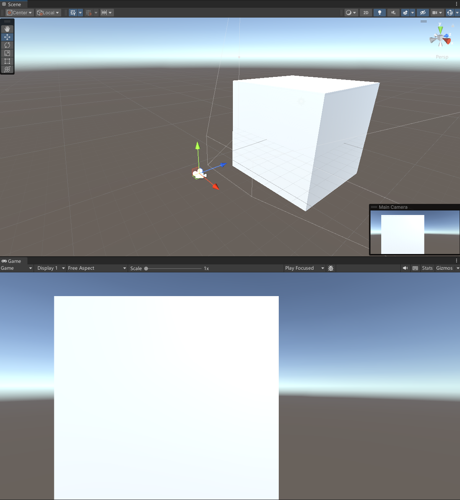
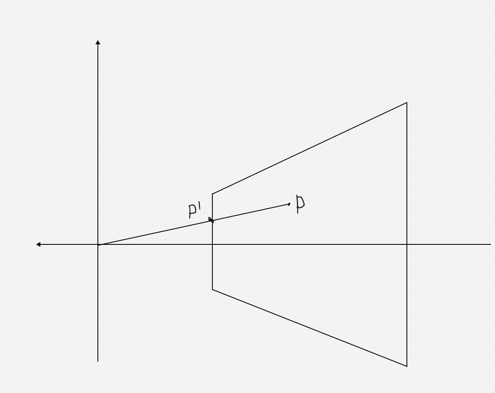

# 透视投影的原理和实现

本文主要介绍透视投影的原理和实现。

那么要了解透视投影，也需要了解一下正交投影，因为这两种投影方式是相对的。

## 投影矩阵需要做什么

投影矩阵的作用是将三维空间中的点投影到二维平面上，这个过程可以用矩阵来表示，也就是说，我们可以用一个矩阵来表示投影的过程。

在我们的shader实现中，在将世界坐标的点转换为摄像机空间坐标之后，我们需要将摄像机空间坐标转换为投影空间坐标，这个过程就是投影矩阵的作用。

注意：在我们的shader中我们需要将其转换为标准化设备坐标，这个过程就是将投影空间坐标转换为标准化设备坐标。

这个过程可以用下面的两张图来表示：

## 正交投影

正交投影如上图，就相当于是每个点发出一条垂直与平面的光线，这样投影到平面上的点就是正交投影的结果。

## 透视投影

透视投影如上图，就相当于是物体上的每个点发出一条光线，这些光线都会汇聚到一个点上，这个点就是摄像机的位置，这样投影到平面上的点就是透视投影的结果。

当然Unity摄像机的near默认为0.3，这里是为了演示方便，所以设置为2

## near & far

由于不可能将世界中的所有点都投射到平面上，所以我们设置了near和far，这样就可以将near和far之间的点投射到平面上。其余的部分我们并不准备渲染。

这也是为什么有时候在游戏中你如果离一个物体太近的话，这个物体会消失不见

## FOV (Field of View)

FOV是视野的意思，也就是摄像机的视野范围，这个值越大，摄像机的视野范围就越大，也就是说，摄像机可以看到的范围就越大。

中文翻译为视场角，这个值的单位是角度，也就是说，FOV为60度，就是说摄像机的视野范围为60度。

FOV有y-FOV和x-FOV之分，y-FOV是指摄像机在y轴上的视野范围，x-FOV是指摄像机在x轴上的视野范围。

一般我们说的FOV都是指y-FOV，也就是说，我们一般说的FOV都是指摄像机在y轴上的视野范围。或者叫vertical FOV。

## Aspect Ratio

Aspect Ratio是指摄像机的宽高比，也就是说，如果你的屏幕是16:9的，那么你的摄像机的宽高比也应该是16:9的。

## 透视投影矩阵

$$aspect = \frac{width}{height}$$

而前一步LookAt的结果是让摄像机在原点，direction为z轴负方向的(Unity因为用的左手系所以是反的)

这里我们指定projection plane为$x=n$

$$y_{p'}=\frac{y_p}{z_p}z_{p'}=\frac{y}{z}n$$

同理

$$x_{p'}=\frac{x}{z}n$$

所以我们的点P

$$
\begin{bmatrix}
x_p\\
y_p\\
z_p\\
1
\end{bmatrix} \rightarrow
\begin{bmatrix}
\frac{n}{z}x\\
\frac{n}{z}y\\
?\\
1
\end{bmatrix}
$$

按道理来说投影到屏幕上的点不需要z坐标的信息。不过由于我们后面会做z-buffer，所以我们需要z坐标的信息。不过z坐标的推导我不会
 :clown_face:

$$
\begin{bmatrix}
x_p\\
y_p\\
z_p\\
1
\end{bmatrix} \rightarrow
\begin{bmatrix}
nx\\
ny\\
(n+f)z-fn\\
z
\end{bmatrix} 
\begin{bmatrix}
\frac{nx}{z}\\
\frac{ny}{z}\\
n+f-\frac{fn}{z}\\
1
\end{bmatrix}
$$

投影矩阵为:

$$
\begin{bmatrix}
n&0&0&0\\
0&n&0&0\\
0&0&n+f&-fn\\
0&0&1&0
\end{bmatrix}
$$

然后将其转换到$[-1,1]^3$的空间就变为了

$$
\begin{bmatrix}
\frac{2n}{r-l}&0&\frac{r+l}{r-l}&0\\
0&\frac{2n}{t-b}&\frac{t+b}{t-b}&0\\
0&0&\frac{n+f}{n-f}&\frac{2nf}{n-f}\\
0&0&1&0
\end{bmatrix}
$$

$r,l,t,b$的定义跟Fundemental Of Computer Graphics中的一样
这一步是上面变换之后乘一个正交投影矩阵

注意这里$n>f$,但是$|n|< |f|$

一般来说我们都有

$$l=-r\\ 
b=-t$$

所以上式可以变为

$$
\begin{bmatrix}
\frac{n}{r}&0&0&0\\
0&\frac{n}{t}&0&0\\
0&0&\frac{n+f}{n-f}&\frac{2nf}{n-f}\\
0&0&1&0
\end{bmatrix}
$$

而我们的参数为$aspect,fov,n,f$

其中

$$
\begin{aligned}
r&=n\tan(\frac{fov}{2})\\
t&=r/aspect
\end{aligned}
$$

所以代入可以得到我们的投影矩阵为

$$
\begin{bmatrix}
\frac{1}{n\tan(\frac{fov}{2})}&0&0&0\\
0&\frac{aspect}{n\tan(\frac{fov}{2})}&0&0\\
0&0&\frac{n+f}{n-f}&\frac{2nf}{n-f}\\
0&0&1&0
\end{bmatrix}
$$

