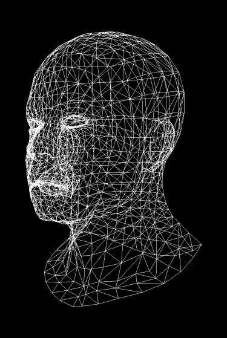

# Tiny Render

## 读取Model

在本次用到的Obj文件中格式比较简单

```obj
v -1 -1 -1
v  1 -1 -1
v  1 -1  1
v -1 -1  1

vt 0 0
vt 1 0
vt 1 1
vt 0 1

vn 0 1 0

f 3/3/1 2/2/1 1/1/1
f 4/4/1 3/3/1 1/1/1

```

- v a b c 表示一个顶点的坐标为(a,b,c)
- vt a b 表示UV坐标
- vn a b c 表示法向量
- f a1/b1/c1 a2/b2/c2 a3/b3/c3 表示面，a/b/c分别是顶点，UV，法向量的**索引**

## 摄像机

一个摄像机应该有以下参数

- 位置 : cameraPosition : vec3
- 方向 : cameraDirection : vec3
实际上是摄像机空间的z轴正方向
- 右轴 : cameraRight : vec3
实际上是摄像机空间的x轴正方向
- 上轴 : cameraUp : vec3
实际上是摄像机空间的y轴正方向

**注** : 我们使用的坐标系是右手系，y表示纵坐标

那么根据以上参数我们就可以得到LookAt(view)矩阵

有关坐标系统的相关知识可以[点击这里](https://learnopengl-cn.github.io/01%20Getting%20started/08%20Coordinate%20Systems/#_5)

## Shader

### Vertex Shader

一般而言，假如在世界坐标系下物体的坐标为$(x,y,z)$,转换为齐次坐标表示为

$$
\vec{v} = \begin{bmatrix}
 x\\
 y\\
 z\\
 1
\end{bmatrix}$$

那么在Vertex Shader当中需要进行一系列的矩阵变换

$$
\vec{coordinate} = M_{Viewport}\times M_{Perspective}\times M_{View} \times M_{Model} \times \vec{v}
$$

此时得到的$\vec{coordinate}$是一个四维的齐次坐标(homogeneous coordinates)，化为标准形式

$$
\vec{coordinate} = \begin{bmatrix}
 x\\
 y\\
 z\\
 w
\end{bmatrix} = \begin{bmatrix}
 x/w \\
 y/w\\
 z/w\\
 1
\end{bmatrix}$$

最后的$x$和$y$分量便是在屏幕下的坐标，$z$分量在z-buffer中会使用到

其中需要用的矩阵根据变换顺序描述如下:

- $M_{Model}$ 物体坐标从局部坐标转换为世界坐标
- $M_{View}$ 将物体坐标从世界坐标转换为摄像机空间坐标
- $M_{Perspective}$ 将物体坐标在摄像机空间进行透视投影并且转换到标准剪裁空间
- $M_{Viewport}$ 将物体坐标在标准剪裁空间转换到屏幕空间

以下是它们的构造方法

- $M_{Model}$ 由于本次物体只有一个，所以我们认为顶点的坐标就是他的世界坐标,$M_{Model} = I_4$
- $M_{View}$ 也叫做LookAt矩阵，构造方式如下：
$$
\begin{bmatrix}
  R_x & R_y & R_z & 0 \\
  U_x & U_y & U_z & 0 \\
  D_x & D_y & D_z & 0 \\
  0 & 0 & 0 & 1
\end{bmatrix}
\times
\begin{bmatrix}
  1 & 0 & 0 & -P_x \\
  0 & 1 & 0 & -P_y \\
  0 & 0 & 1 & -P_z \\
  0 & 0  &0 & 1
\end{bmatrix}
$$
其中$R,U,D,P$分别表示摄像机的cameraRight,cameraUp,cameraDirection,cameraPostion
glm库提供了lookAt()函数，可以直接进行构造，不过在本项目我们将**手动构造**
有关LookAt矩阵的更多信息可以[点击这里](https://learnopengl-cn.github.io/01%20Getting%20started/09%20Camera/),
**注意:glm中的matrix是列主序的，所以在构造的时候需要注意**
- $M_{Perspective}$是透视投影矩阵，构造方式如下：
$$
\begin{bmatrix}
\frac{1}{aspect\tan(\frac{fov}{2})}&0&0&0\\
0&\frac{1}{\tan(\frac{fov}{2})}&0&0\\
0&0&\frac{n+f}{n-f}&\frac{2nf}{n-f}\\
0&0&1&0
\end{bmatrix}
$$
其中$aspect$表示屏幕的宽高比，$fov$表示视野，$near$和$far$分别表示近平面和远平面的距离
glm库提供了perspective()函数，可以直接进行构造，不过在本项目我们将**手动构造**
有关透视投影矩阵的更多信息可以[点击这里](https://learnopengl-cn.github.io/01%20Getting%20started/08%20Coordinate%20Systems/)
可以看同目录下的perspective.md文件
- $M_{Viewport}$是视口变换矩阵，构造方式如下：
$$
\begin{bmatrix}
  \frac{width}{2} & 0 & 0 & \frac{width}{2} \\
  0 & \frac{height}{2} & 0 & \frac{height}{2} \\
  0 & 0 & \frac{far - near}{2} & \frac{far + near}{2} \\
  0 & 0  &0 & 1
\end{bmatrix}
$$
其中$width$和$height$分别表示屏幕的宽和高

实现可以见line-renderer.cpp

效果如下



### Fragment Shader

在Fragment Shader中我们需要进行插值，插值的内容包括

- 顶点的颜色
- 顶点的纹理坐标
- 顶点的法向量(变得更加平滑)

插值的方式是线性插值，即

$$
\vec{v} = \vec{v_1} + \frac{d}{d_1}(\vec{v_2} - \vec{v_1})
$$

#### 填充一个三角形

在填充一个三角形的时候，我们需要知道三角形的三个顶点的坐标，颜色，纹理坐标，法向量,不过这些我们都可以在ObjModel当中找到，所以我们只需要知道三角形的三个顶点的索引即可

跟triangle-renderer.cpp中的实现类似，我们需要找到bouding box，然后对于每一个像素点，我们需要判断这个像素点是否在三角形内部，如果在三角形内部，那么我们就需要计算这个像素点的颜色，纹理坐标，法向量